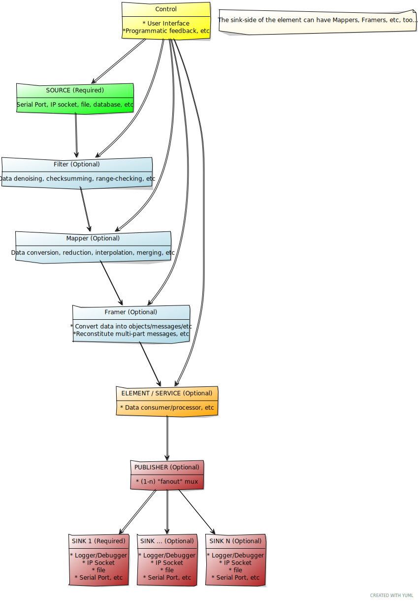

:subtitle: Architecture notes
:toc: macro
:doctype: book
// :title-logo-image: images/agritronics-logo.png 
:source-highlighter: rouge
:icons: font

= MicroServices Plus-Plus (MSPP): {subtitle}
:Author: Allan Jones
:email: allan@mayhemmonkeys.com

<<<
== Copyright and Trademarks

.The license for both documentation and source code:
----
MIT LICENSE 

Copyright (c) 2023,  Allan Jones, allan@mayhemmonkeys.com

Permission is hereby granted, free of charge, to any person obtaining a copy
of this software and associated documentation files (the "Software"), to deal
in the Software without restriction, including without limitation the rights
to use, copy, modify, merge, publish, distribute, sublicense, and/or sell
copies of the Software, and to permit persons to whom the Software is
furnished to do so, subject to the following conditions:

The above copyright notice and this permission notice shall be included in all
copies or substantial portions of the Software.

THE SOFTWARE IS PROVIDED "AS IS", WITHOUT WARRANTY OF ANY KIND, EXPRESS OR
IMPLIED, INCLUDING BUT NOT LIMITED TO THE WARRANTIES OF MERCHANTABILITY,
FITNESS FOR A PARTICULAR PURPOSE AND NONINFRINGEMENT. IN NO EVENT SHALL THE
AUTHORS OR COPYRIGHT HOLDERS BE LIABLE FOR ANY CLAIM, DAMAGES OR OTHER
LIABILITY, WHETHER IN AN ACTION OF CONTRACT, TORT OR OTHERWISE, ARISING FROM,
OUT OF OR IN CONNECTION WITH THE SOFTWARE OR THE USE OR OTHER DEALINGS IN THE
SOFTWARE.

The information in this document is subject to change without notice.                                 
This document is intended for the use of  LLC staff and assignees.
No part of this document may be reproduced or transmitted in any form or means without                                 
the prior written permission of Tampa Microwave LLC. This document and the product                                 
it describes are considered protected by copyright according to applicable laws.
----

toc::[]

<<<
[#intro]
== Introduction

=== MicroServices Framework

*Objectives:*
. Independently Deployable Deliverables
. Ease of Unit Testing and Black Box Testing
. Support for design variants in hardware changes -- upgrades, additions, etc.
. Support for design variants in software changes -- upgrades, bug-fixes, new features, etc.
. 

=== Pipeline Architecture

The microservice services are loosely coupled using a pipeline strategy, like so:

=== Pipeline interconnects

The interconnect between services uses NNG (Nanomesg, Next-Generation).

=== Pipeline Services URIs

. Refer to *RFC 2609*
. Also refer to *RFC 2608*, *RFC 3224* -- AKA: Service Location Protocol, or "srvloc":

.. A prototype SLP URI would look like:

----
service:mspp:logging:sink:file:file:///opt/mspp/logging/log.txt
----

----
service:mspp:logging:sink:socket:nng:localhost:5150
----

include::colophon.adoc[]

